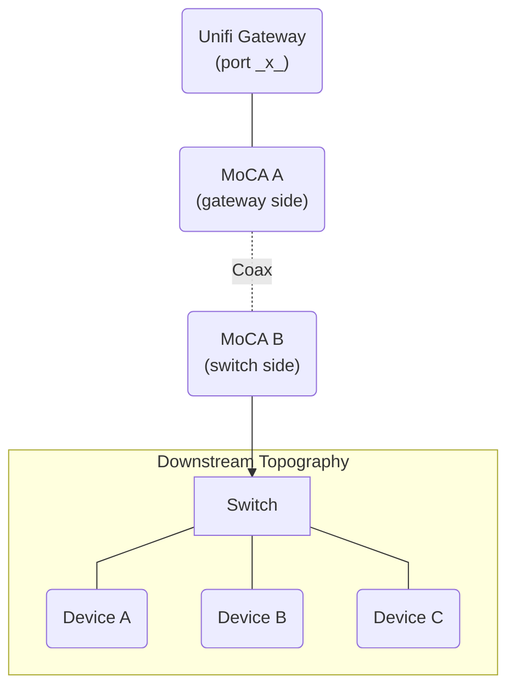
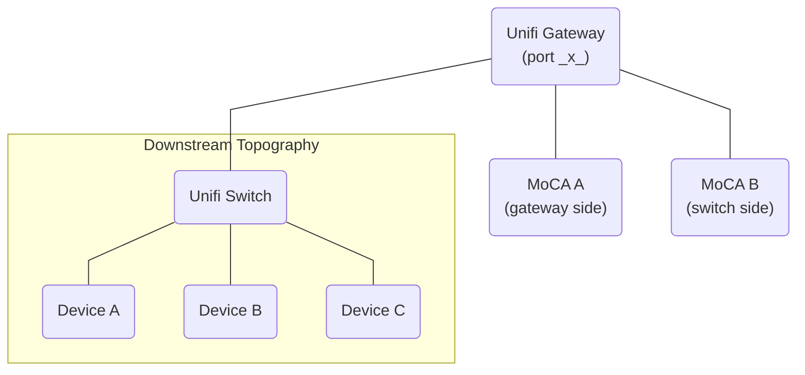
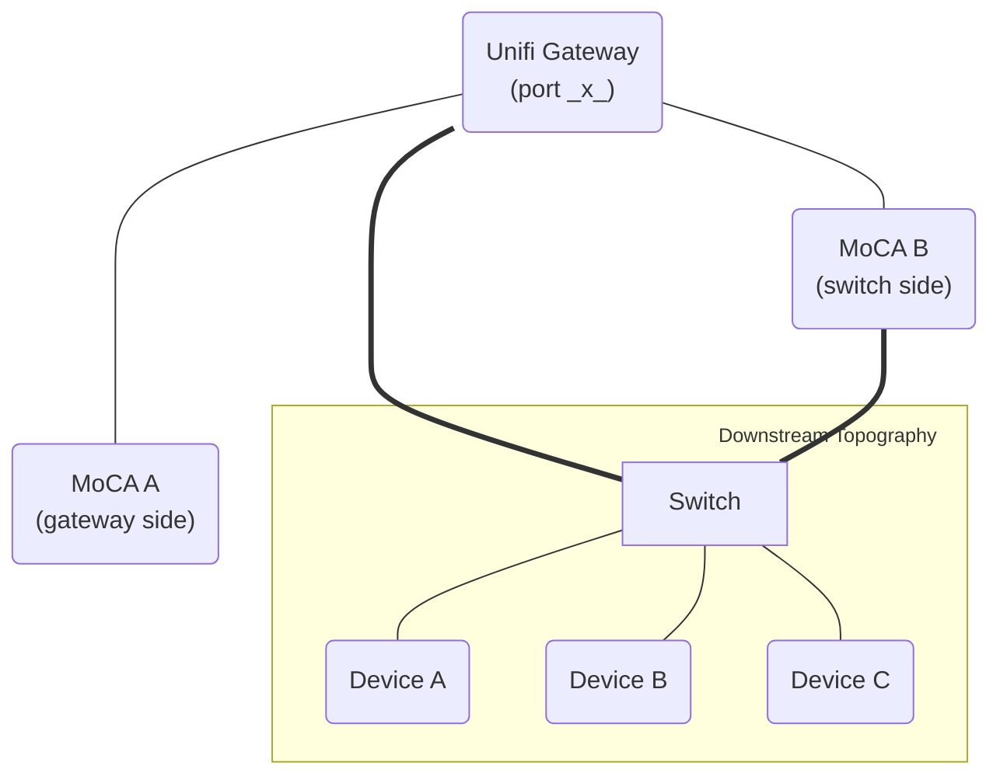
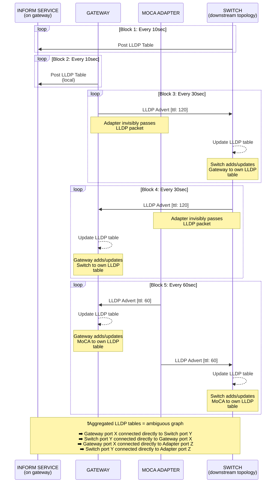

import { Image } from 'astro:assets'
  import inacurateStatusImage from './moca-inaccurate-status.png'


If you have ever integrated [MoCA](https://en.wikipedia.org/wiki/Multimedia_over_Coax_Alliance) devices into a Unifi network, there is also a chance that you have also spotted some bugbears around how the Unifi Network application perceives them:

- The MoCA adapters appear and disappear spuriously in the topology view.
- The "connected" status of the MoCA adapters shows them as offline (or flip-flops).
- Certain subtrees of your network on the topology view move around or get reparented regularly.

These irritations could be viewed as superficial and not worth fixing, with the severity varying depending on what you care about and your expectations. 

On a subjective level, there is a slight disappointment that the UI does not reflect your Unifi-based network-of-dreams accurately. But these issues lean into meaningful ones when debugging the network, or if you wish to leverage Unifi's standard logging/events to monitor the MoCA link and its uptime.

The core function of the MoCA devices, of course, works great without any extra effort (and in my case, they perform far beyond my wildest expectations!). I suspect most folks write off these Unifi niggles and live with it -- a very sane conclusion. Besides, Unifi's topology view getting itself into an inconsistent state for a whole host of differing scenarios is a common source of complaints.

However, I did not want my fancy new network refactor to be marred by this blemish, so I took to SSH to analyse the mechanics that caused these problems. Surprisingly, I managed to configure my way to a better position.

## Prerequisites

> [!WARNING]
> Whilst I believe it is likely that these tweaks apply to all MxL37xx-based adapters, I can't fully confirm that beyond the [StarLink MN2580](https://starlink7.com/MoCA.html) that is used for this post. Please report back with a comment! It's also possible that different vendors have already applied some of these changes.

Before continuing, make sure each of these points applies to you.

- This post applies only to devices based on the venerable MaxLinear MxL37xx. The MxL37xx SOC is used by various products in the MoCA market, and is the one utilised by some of the most well-regarded adapters such as the [goCoax 2500D](https://www.gocoax.com/ma2500d), [ScreenBeam ECB7250](https://www.screenbeam.com/products/screenbeam-ecb7250/) & [ECB6250](https://www.screenbeam.com/products/home-networking/ecb6250/) -- amongst many more.

- It is assumed you can access the web interface of each MoCA device, and you have already changed the configuration of each such that they have an IP on the Unifi network (typically via DHCP). If not, please reference the manual of your device.

## Link status accuracy

The "connected" status of your MoCA adapters in the Unifi network application may not reflect reality. In my case, the adapters were often reported as disconnected, despite everything being fully operational.
Notably, visiting the management interface of an adapter in a browser brings it back to an online status for a brief period.

<figure>
  <Image
    src={inacurateStatusImage}
    alt="Screenshot of MoCA device in Unifi Network application, showing falsely reported link status"
    style={{ maxWidth: '550px' }}
    quality="max"
  />
  <figcaption style={{ maxWidth: '550px' }}>
 Your MoCA devices probably report as down often. The solid green at the end
 is for the period after the fix was applied.
  </figcaption>
</figure>

The reasons behind this are:

1. MoCA devices are essentially third-party network hardware. Therefore, they are treated like any other "client". They don't benefit from the special exceptions and discovery paths that first-party Unifi hardware enjoys.
2. There's generally not much "userland" traffic going to the management interface, other than the rare occasion you visit it in the browser. Therefore, the network app has nothing to detect when you are not actively using it. Note that production traffic over the link itself is irrelevant to the device's management interface, which we care about here.
3. Passively, the MoCA devices are very quiet (which is generally a good thing, but not for Unifi's understanding). Through my ad-hoc packet monitoring, I found they chirp almost nothing on fundamental L2/L3 network protocols beyond initial interactions when they are connected to the network. Exceptions include the occasion when it needs to get a new DHCP lease, which appears to be every 24 hours.

These factors combine to the point that the conditions under which Unifi considers a device "offline" are reached, which in Unifi is something of a pseudonym for "idle or disconnected" -- at least for _clients_ -- which the MoCA device _is_ as far as Unifi is concerned.

We _could_ consider generating traffic by `ping` or otherwise to coerce Unifi to "see" the device. Apart from feeling hacky, it's also inconvenient as it requires orchestrating said cron activity somewhere external to the MoCA device. For that reason, I didn't bother exploring that path.

### Configuring Gratuitous ARP

This is where the magic sauce comes in. There's no UI control for it on the web-based MoCA management interface, but I was pleasantly surprised to find the device actually _can_ be configured to chirp [ARP](https://en.wikipedia.org/wiki/Address_Resolution_Protocol) requests at short regular intervals. This is known as [gratuitous ARP](https://en.wikipedia.org/wiki/Address_Resolution_Protocol#ARP_announcements).

Technically, it doesn't _need_ to perform these requests unless its entry was removed in the neighbour ARP table and the user wants to access the management interface (which appears to be the default behaviour). But by configuring _regular_ ARP lookups to provide a "keep-alive", the device is then accurately considered to be "connected" in the Unifi network app.

Note down the IP address of each MoCA adapter, and execute the following for each of them from any device that can see the management interface:


> [!NOTE]
> You can run this command with `INTERVAL_SECONDS` set to `0` to reverse the change, such that regular ARP requests are disabled. As a fallback, you can also use the reset button on your device to go back to the defaults. 

```bash showLineNumbers=false
# Uncomment and change example values.
#
# The default user/pass is vendor-specific
# and should be referenced in the manual (aside: please also change it from
# those defaults!).
#
# The interval should be less than your ARP cache timeout as configured on
# your Gateway. 60 seconds is probably a good value.
#
# WEB_USER="admin"
# WEB_PASS="admin"
# IP="192.168.1.55";
# INTERVAL_SECONDS="60"
#
curl -u "$WEB_USER:$WEB_PASS" "http://$IP/ms/1/0x251/PUT" \
 --data-raw "{\"data\":[\"$(printf '0x%08X' \"$INTERVAL_SECONDS\")\"]}" \
 --cookie "csrf_token=1" \
 --header "X-CSRF-TOKEN: 1"
```

My incantation uses `bash` with `curl`, but you can make the same request by whatever means you prefer. I didn't test if this is effective immediately as I performed a reboot of the device after this change using the button available on the web UI, but regardless, it's best you reboot to be sure.

You can now enjoy accurate reporting of the connected status in the Unifi network app and eliminate some of the thrashing on the topology map associated with this particular issue.

## Inaccurate topology

The topology map likely shows an inaccurate picture of the real-world connections. However, because of the previous fixes, the topology should now at least be _stable_. You may choose to be satisfied at this point.

This issue is significantly more nuanced because the approach could vary depending on your scenario. Whilst it's possible to improve it, a _perfect_ solution is not easily obtained.

### Actual topology

Let's first take a look at a rough abstraction of the real-world connections for my test scenario:



Note that other layouts may or may not benefit from the tricks in this thread. The notable properties of this real-world topology are:

* There are only two MoCA devices.
* Each MoCA device has a direct connection to Unifi hardware.

I will reference the network that exists on the "far side" of the coax (connected to MoCA B) as the "downstream topography" from here onwards. Additionally, the port on the Gateway that MoCA A is connected to is referred to as "port x".


### Unifi's perspective

Unifi's topology map does not accurately reflect this. Both of the MoCA devices are shown as directly connected to port x on the Gateway. The downstream topography _also_ appears to be directly connected to that same port. 





So *why* is this happening? Well, currently, Unifi only has one data point to work with regarding the MoCA devices: the ARP requests sent by each of them.

Since the MoCA devices are hubs and not routers, so they don't "consume" ARP requests. They will pass on all of those messages as-is. 

The Gateway sees multiple devices with different MAC addresses connected to *one* of its ports -- port "x". ARP requests don't contain any information about what else the requesting device might be connected to, or to which of *their* ports. It is only enough for the Gateway to know that the requesting device is on the network, and that its trunk can ultimately be traced back to its *own* Ethernet port _x_.

Its location within the real-world topology, beyond that trunk, is unknown. It could be directly connected. It could be many hops away. Unifi shows these devices as directly connected to the Gateway in this scenario, rather than not at all.

Typically, Unifi can accurately display the topology of its *own* devices when they are directly interconnected. To do this, they blend common standards beyond ARP with Unifi-specific behaviours.

If we align with such behaviours, we could reach an improved map.


### Primer on LLDP and Unifi

To grasp the next section, I must break out to deliver my understanding of LLDP/Unifi behaviours.

Part of the heuristics Unifi employs to draw the topology map are predicated on data ultimately sourced from [Local Link Discovery Protocol](https://en.wikipedia.org/wiki/Link_Layer_Discovery_Protocol) (LLDP).

LLDP is an open standard operating on the L2 layer. An LLDP-enabled device can periodically broadcast an LLDP Ethernet frame to all of its ports regularly to "advertise" itself to its "neighbours". Those of the recipients that also support LLDP might also retain a "neighbour table" internal to themselves to store that information. The recipient device now knows "somewhere on port _x_, there's a device with MAC address _y_". The entries in the table expire after the TTL (which is defined in the original message) expires. And of course, multiple connected devices could be talking LLDP back to each other.

Crucially, switches do not retransmit LLDP advertisements they receive. LLDP frames are transmitted on a reserved MAC address (`01-80-C2-00-00-0E`). As an Ethernet frame is received by a switch, and subsequently acknowledged to have been received on that address, it is processed as an LLDP message, and the data contained within is used to update the switch's own neighbour table. Nothing upstream will ever see that message; that's where the lifetime of that frame ends. It is worth noting that routers are also switches, so they have an LLDP neighbour table representing their own local neighbours, too.

Therefore, LLDP alone is insufficient to inform the core gateway of the entire topology magically. Instead, *localised* knowledge of the topology is distributed bit by bit amongst the internal neighbour tables of the switches within the network. Each individual switch only knows who *its own* LLDP-transmitting neighbours are and which of *its own* ports they are connected to.

But in a perfect world where everything cooperates (such as a complete Unifi first network in which each Unifi network device dutifully transmits and processes LLDP frames), it can be supposed that a complete network topology map could be computed from the *aggregate* of all of those neighbour tables.

It is *this* situation that Unifi can leverage proprietary behaviours. Unifi devices (switches, etc), regularly *push* their own neighbour tables back to the Unifi gateway via a Unifi-specific HTTP service reached via what is known as the "Inform URL". As above, the Gateway can then aggregate the distributed LLDP tables, compute the graph, and realise the broader network topology in its network app UI.

As part of my investigation, I spent time on the Gateway working with `lldpcli` (`show neighbours`) and `tcpdump -i any -nnn -vvv -e -s0 ether proto 0x88cc` to observe the Gateway's local LLDP table and the raw LLDP frames being received on its sockets. This was particularly handy in my scenario, where the gateway-side MoCA device is directly connected to the Gateway.

Unfortunately, the Unifi switch on the far end of my MoCA devices is not L3, so I'm unable to view its neighbour table as seen locally. But I can see Unifi Inform packets arriving on the Gateway transmitted from it via `tcpdump -i switch0.<vlan> -s 0 -A 'tcp and port 8080'`. It is, however, a proprietary [binary format](https://github.com/jeffreykog/unifi-inform-protocol/blob/master/README.md) that includes an encrypted payload. I didn't go through the effort of decrypting it after I verified my upcoming hypothesis by other means. Still, by all accounts, part of it is a derivative representation of the switches LLDP table in JSON.

### Enabling LLDP on MoCA

If the MxL37xx MoCA devices supported LLDP in some capacity, we could leverage it to improve the Unifi network app's realisation of the network topology. You can sense the blatant presupposition throughout already, so I will happily confirm that they *do* support it via some advanced config.

This was another pleasant surprise. 99.9% of users aren't even thinking about this stuff. I'm sure there is some enterprise-y reasoning behind it, but nevertheless, I have to applaud the fact that this device/SOC has the necessary feature set to solve what is now *two* esoteric problems.

On **one** of the MoCA devices that exists as one of the intermediaries between the source and destination Unifi hardware, enable it as follows:


> [!WARNING]
> You may be tempted to enable LLDP on both MoCA devices, but this yields poor results. More on that later.

> [!NOTE]
> You can run this command with `LLDP_ON` set to `false` to turn LLDP back off again. As a fallback, you can also use the reset button on your device to go back to the defaults. 

```bash showLineNumbers=false
# Uncomment and change example values.
#
# The default user/pass is vendor-specific
# and should be referenced in the manual (aside: please also change it from
# those defaults!).
#
# WEB_USER="admin"
# WEB_PASS="admin"
# IP="192.168.1.55";
# LLDP_ON=true
#
curl -u "$WEB_USER:$WEB_PASS" \
 "http://$IP/ms/1/0x214/PUT" \
 --data-raw "{\"data\":[\"$([ \"$LLDP_ON\" = \"true\" ] && echo 0x00000001 || echo 0x00000000)\"]}" \
 --cookie "csrf_token=1" \
 --header "X-CSRF-TOKEN: 1"
```

Again, I will state that my incantation uses `bash` with `curl`, but you can make the same request by whatever means you prefer. I didn't test if this is effective immediately as I performed a reboot of the device after this change using the button available on the web UI, but regardless, it's best you reboot to be sure.

### Limitations & Expectations

Before I move on to detail how this affects the graph, I need to state some fundamental limitations that I believe have no viable workaround:

1. One of the MoCA devices (the one with LLDP disabled) will always show as directly connected to the Gateway, with no forward connections to any other device. I.e. it is "orphaned".
2. It is impossible to get the MoCA link between the two adapters to become visible on the topology graph. 

> [!NOTE]
> Enabling LLDP on both MoCA devices doesn't help since, for that to be useful, Unifi would need to know the internal LLDP tables of each MoCA device to understand their coaxial interconnection -- which it fundamentally can not since they are third party.
>
> Enabling LLDP on the adapter is helpful in a more indirect way. By sending LLDP advert frames, connected Unifi equipment will register it in _their_ table. This will become clearer in the analysis to come.


However, you *can* achieve a topology representation whereby _one_ of the MoCA adapters exists as the intermediary, interconnecting both the topology on the gateway-side of the link and the "downstream topology" on the other side of that link.

This is imperfect, but does deliver an improvement in that it is now apparent that a MoCA connection exists and what it exists between — albeit in a semi-accurate abstract way, where only one of the adapters appears to participate in this link.


### Observing the results

This _almost_ has the desired effect.

The MoCA device on which LLDP was enabled can be briefly seen as interconnecting the Gateway and the topology on the far side of the MoCA link.

Unfortunately, as depicted in this animated diagram, the "downstream topology" will periodically reparent between the MoCA device and the Gateway, switching between them irregularly every minute or so. 



Generally, this "reparenting" problem results from the inherent requirement that MoCA devices have to act as a network "hub". These devices have no MAC-level intelligence by design: they regenerate every electrical signal they see and will forward LLDP frames (and everything else).

The management interface that can emit LLDP is orthogonal to its inherent end-user purpose of connecting source and destination via hub-like behaviour. On top of this, you must consider that Unifi only receives reports of the LLDP neighbour tables from Unifi hardware. Any internal table that may or may not be kept by the MoCA devices is invisible to Unifi.

But once enabled, the MoCA devices do *transmit* LLDP neighbour advertisements.


### Analysing the problem

It should be technically enough for _one_ LLDP MoCA device to appear in the Unifi topology view, correctly positioned between its Unifi source and Unifi destination, and *consistently* displayed that way. The Unifi devices will register it in their neighbour table and can report it back to the Gateway. This clearly works, but only for brief, fluctuating periods.

Why does the topology in the Unifi network app appear to switch randomly, breaking the expectation of consistency? After some brain-melting debugging, I can compress my findings into a sequence diagram.



Let's provide some context for this diagram to make sense. The "actors" shown are:

1. The **Inform Service** is the service that presents the Unifi-specific HTTP endpoint used by Unifi devices to post back their own LLDP tables. This runs on the Unifi gateway. It is represented separately from the **Gateway** to help disambiguate it from the Gateway's own LLDP implementation, which has its own LLDP neighbour table, that is itself locally posted back to the Inform Service.
2 The **Gateway** depicts interactions with the LLDP daemon running on the Gateway.
3. The **MoCA Adapter** depicts interactions with the LLDP daemon running on the single MoCA adapter on which we enabled LLDP.
4. The **Switch**  depicts interactions with the LLDP daemon running on the Unifi switch, which in my case is the first device within the "downstream topology" on the other end of the MoCA link.

 In the diagram, the dotted-lined boxes denoted by "loop" represent processes that run in parallel to each other. Those processes are invoked at fixed time intervals. Detailing each loop from top to bottom, we have:

1. The regular POST performed by the switch back to the inform endpoint. It contains the switch's LLDP table.
2. The regular POST performed by the Gateway back to the inform endpoint (local request). It contains the Gateway's LLDP table.
3. The regular LLDP advert frames sent by the Gateway.
4. The regular LLDP advert frames sent by the switch.
5. The regular LLDP advert frames sent by the LLDP-enabled MoCA device.

By unravelling the interactions, we can understand why Unifi's interpretation of the LLDP neighbour tables is ambiguous:

1. Since the MoCA device blindly forwards LLDP advert frames originating from the switch and the Gateway, the switch is present in the neighbour table of the Gateway, and vice versa.
2. Simultaneously, the MoCA devices' own LLDP advert frames reach both the switch and the Gateway, meaning the MoCA device is _also_ present in the neighbour table of the switch and Gateway.

In isolation, _(1)_ leads to an "incorrect" topology representation. The switch and the Gateway are not directly connected in the real world, so this is undesirable. On the other hand, (2) leads to the more desirable interpretation, with the (LLDP-enabled) MoCA device sitting between the different subsets of topology on either end of the link. 

When both are in play simultaneously, Unifi prioritises LLDP table data on some dimension related to time (probably whichever table entries are newer). Since there are several intersecting intervals here, the realisation shown on the UI fluctuates over time.

### Possible approaches to stabilise the topology

Suppose we could manipulate the LLDP neighbour tables or the advert frames. In that case, we could eliminate the mechanism described in _(1)_, thus leaving only the _desirable_ mechanism described in _(2)_ in play.

My switch in this example is an L2 switch, so it does not have shell access. Unifi do not provide rich controls of LLDP via their software (the LLDP-MED tickboxes do not control base LLDP behaviours). That means trying to prevent LLDP frames from being sent/received by the switch is a doomed approach, at least in my case.

Approaching the problem by working with the device where you *do* have shell access (in my case, the Gateway) also has limitations:

* There is no way to block specific LLDP frames (i.e. via their source MAC Address) from being received. The frames are processed on a low level within the kernel, long before any `ebtables` rules are executed. The [LLDP daemon](lldpd.github.io) listens directly on the physical interface.
* There is no available configuration that you can apply to the [LLDP daemon](lldpd.github.io) to filter specific packets at the application layer via source MAC.

However, by configuration, you *can* modify the LLDP daemon behaviour for a _specific port_. A given port can be configured as `tx-only`, `rx-only`, `rx-and-tx` or `disabled`:

* `tx` refers to whether LLDP advert frames advertising the Gateway should be emitted on the given port. 
* `rx` refers to whether LLDP advert frames received on the given port should be processed and inserted into the Gateway's neighbour table.


### Reconfiguring LLDP on the Gateway
> [!important]
> I have not explored how to persist this across reboots of the Gateway at this time. I will update this post once that is tackled.

We can SSH into the Gateway and execute:

```bash showLineNumbers=false
lldpcli
```

Then in the prompt (replacing *X* with the port on the Gateway that leads on to the MoCA device and subsequently the downstream MoCA device and downstream topology):

```bash showLineNumbers=false
configure ports ethX lldp status rx-only
```

After waiting a minute for old LLDP entries to become stale, I found the topology had stabilised to the desired representation! By disabling `tx` on the Gateway for the relevant port, we ensure that the Gateway is never registered directly in the switch's neighbour table, since there are no longer any LLDP adverts from the Gateway for the switch to receive in the first place.

Curiously, with `rx` still enabled, the switch is still registered in the _Gateway_ neighbour table. However, I hypothesise Unifi heuristics around the topology view do not consider it to be directly connected since the reverse relationship is no longer present.

Indeed, you can even get the same results by _completely disabling_ LLDP (both `rx` and `tx`) on the relevant gateway port. I suspect that is because in the absence of any incoming LLDP information, the Gateway is still understood to be connected to the MoCA adapter by way of falling back to heuristics based on ARP. The connection between the switch and the MoCA device remains since the switch still receives the MoCA device's adverts and sends its table back to the inform endpoint.


## Recap

I encourage anyone who wants to achieve this to understand how this write-up relates to their setup.

But the general steps needed to get an improved and stable Unifi topography view are:

1. [Enable gratuitous ARP](#configuring-gratuitous-arp) on both MoCA devices.
2. [Enable LLDP](#enabling-lldp-on-moca) on one of the MoCA devices.
3. [Reconfigure the LLDP daemon](#reconfiguring-lldp-on-the-gateway) on one of the Unifi devices at either end of the link.

As a final note, if the non-LLDP enabled MoCA device being orphaned bothers you, then you could disable gratuitous ARP on that device such that it becomes invisible on the topology view when the management web UI is not in use.

