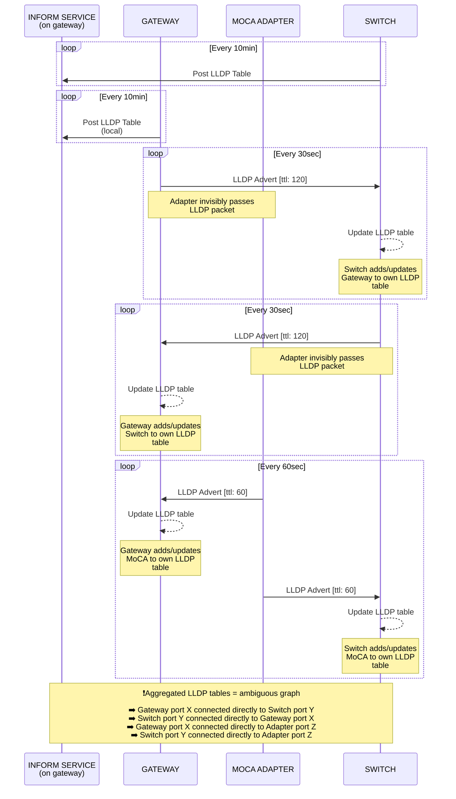

import { Image } from 'astro:assets'
import inacurateStatusImage from './moca-inaccurate-status.png'

If you have ever integrated [MoCA](https://en.wikipedia.org/wiki/Multimedia_over_Coax_Alliance) devices into a Unifi network, there is also a chance that you have also spotted some bugbears around how the Unifi Network application perceives them:

- The MoCA adapters appear and dissapear spuriously in the topology view.
- The "connected" status of the MoCA adapters shows them as offline (or flip-flops).
- Certain subtrees of your network on the topology view move around or get reparented at regular intervals.

These irritations could indeed be viewed as somewhat superficial and not worth fixing, with the severity undoubtedly varying depending on what you care about and your expectations. They do lean into meaningful when debugging the network, or if you wish to leverage Unifi's standard logging/events as a means to monitor the MoCA link and its uptime. Or if you simply feel fleeting disssapointment each time you find yourself browsing the Unifi UI and noticing that your Unifi-based network-of-dreams is not being accurately reflected.

The core function of the MoCA devices of course works great without any extra effort (and in my case performs far beyond my wildest expectations!). I suspect most folks write off these Unifi niggles and live with it -- a very sane conclusion. Besides, Unifi's topology view getting itself into an insonsistent state for a whole host of differing scenarios is a common source of complaints.

But, not wanting my fancy new network refactor to be marred by this blemish, I took to SSH to analyse the mechanics that cause these problems. To my surprise, I managed to configure my way to a better position.

## Prerequisites

> [!WARNING]  
> Whilst I beleive it is likely that these tweaks apply to all MxL37xx-based adapters, I can't fully confirm that beyond the [StarLink MN2580](https://starlink7.com/MoCA.html) that is used for this post. Please report back with a comment! It's also possible different vendors have already applied some of these changes.

Before continuing, make sure each of these points applies to you.

- This post applies only to devices that are based on the venerable MaxLinear MxL37xx. The MxL37xx SOC is used by various products in the MoCA market, and is the one utilised by some of the most well-regarded adapters such as the [goCoax 2500D](https://www.gocoax.com/ma2500d), [ScreenBeam ECB7250](https://www.screenbeam.com/products/screenbeam-ecb7250/) & [ECB6250](https://www.screenbeam.com/products/home-networking/ecb6250/) -- amongst many more.

- It is assumed you are able to access the web interface of each MoCA device, and you have already changed the configuration of each such that they have an IP on the Unifi network (typically via DHCP). If not, please reference your devices manual.

## Link status accuracy

The "connected" status of your MoCA adapters in the Unifi network application may not reflect reality. In my case the adapters were being reported as disconnected most of the time, despite everything being fully operational.
Noteably, visiting the management interface of an adapter in a browser brings them back to an online status for a brief period.

<figure>
  <Image
    src={inacurateStatusImage}
    alt="Screenshot of MoCA device in Unifi Network application, showing falsely reported link status"
    style={{ maxWidth: '550px' }}
    quality="max"
  />
  <figcaption style={{ maxWidth: '550px' }}>
    Your MoCA devices probably report as down often. The solid green at the end
    is for the period after the fix was applied.
  </figcaption>
</figure>

The reasons behind this are:

1. MoCA devices are essentially third party network hardware, therefore they are treated like any other "client". They don't benefit from the special exceptions and discovery paths first-party Unifi hardware enjoys.
2. There's generally not much "userland" traffic going to the management interface, other than the rare occasion you visit it in the browser. Therefore the network app has nothing to detect by that means when you are not actively using it. Note production traffic over the link itself is not relevant to the devices management interface, which is what we care about here.
3. Passively, the MoCA devices are very quiet (which is generally a good thing, but not for Unifi's understanding). Through my ad-hoc packet monitoring, I found they chirp almost nothing on fundamental L2/L3 network protcols beyond initial interactions when they are connected to the network. Exceptions include the occasion it needs to get a new DHCP lease, which appears to be every 24 hours.

These factors combine to the point the conditions under which Unifi considers a device "offline" are reached, which in Unifi is something of a pseudonym for "idle or disconnected" -- at least for _clients_ -- which the MoCA device _is_ as far as Unifi is concerned.

We _could_ consider generating traffic by `ping` or otherwise in order to coerce Unifi to "see" the device. Apart from feeling hacky, it's also incovenient as it requires orchestrating said cron activity somewhere external to the MoCA device. For that reason I didn't bother exploring that path.

### Configuring Gratuitous ARP

This is where the magic sauce comes in. There's no UI control for it on the web-based MoCA management interface, but I was pleasantly surprised to find the device actually _can_ be configured to chirp [ARP](https://en.wikipedia.org/wiki/Address_Resolution_Protocol) requests at short regular intervals. This is known as [gratuitous ARP](https://en.wikipedia.org/wiki/Address_Resolution_Protocol#ARP_announcements).

Technically, it doesn't _need_ to perform these requests unless its entry was removed in the neighbour ARP table and the user wants to access the management interface (which appearts to be the default behaviour). But by configuring _regular_ ARP lookups as a means to provide a "keep-alive", the device is then accurately considered to be "connected" in the Unifi network app.

Note down the IP address of each MoCA adapter, and execute the following for each of them from any device that can see the management interface:


> [!NOTE]  
> You can run this command with `INTERVAL_SECONDS` set to `0` to reverse the change such that regular ARP requests are disabled. As a fallback, you can also use the reset button on your device to go back to the defaults. 

```bash showLineNumbers=false
# Uncomment and change example values.
#
# The default user/pass is vendor specific
# and should be referenced in the manual (aside: please also change it from
# those defaults!).
#
# The interval should be less than your ARP cache timeout as configured on
# your gateway. 60 seconds is probably a good value.
#
# WEB_USER="admin"
# WEB_PASS="admin"
# IP="192.168.1.55";
# INTERVAL_SECONDS="60"
#
curl -u "$WEB_USER:$WEB_PASS" "http://$IP/ms/1/0x251/PUT" \
  --data-raw "{\"data\":[\"$(printf '0x%08X' \"$INTERVAL_SECONDS\")\"]}" \
  --cookie "csrf_token=1" \
  --header "X-CSRF-TOKEN: 1"
```

My incantation is using `bash` with `curl`, but you can of course perform the same request by whatever means you prefer. I didn't test if this is effective immediately as I performed a reboot of the device after this change using the button available on the web UI, but regardless it's best you reboot to be sure.

You can now enjoy accurate reporting of the connected status in the Unifi network app, and also get rid of some of the thrashing on the topology map associated with this particular issue.

## Inaccurate topology

This issue is significantly more nuanced in that the approach taken could vary depending on your scenario. Whilst it's possible it can be improved, there are also Unifi limitations at play that mean a _perfect_ solution is not easily obtained.

After the fixes in the previous section, the topology map likely shows the MoCA devices directly connected to the same port on an upstream Unifi device (e.g. the upstream gateway port). Any network topology on the "other side" of the MoCA link _also_ appears as being directly connected to that same port. 

However, because of the previous fixes, the topology should now at the very least be _stable_. You may simply choose to be satisfied at this point.

### Ideal representation vs possible representation

However, it would be nice if we could get some semblance of the reality of the physical connections. Primarily, the topology on the "other side" of the MoCA link would ideally appear as being connected to an adapter and then onwards to the next upstream device.

In a perfect world that next upstream device would be the _other_ MoCA adapter sitting closer to the gateway side and _then_ onwards to the gateway/switch upstream -- which would in my case be the wholly accurate representation of the physical reality. However I beleive this particular level of perfection is not practically reachable for reasons that I will explain.

Therefore, I will settle for a solution whereby the "other side" topology correctly displays as connected to the nearby MoCA device, but then from there skips over the other MoCA device and instead goes on to be connected to the _next_ onwards device.

That means the _other_ MoCA device remains somewhat visually orphaned in that it still appears as directly connected to the upstream gateway/switch, and does not visually connect to any onwards devices. However, this setup does still convey MoCA is involved in some hop, which is a significant improvement.

### Why Unifi's topology map doesn't "just work"

So *why* are both the MoCA devices, as well as the topology on the far side, appearing as directly connected to the gateway? Because Unifi only has the ARP requests sent by the MoCA devices to work with.

Since the MoCA devices are hubs and not routers, they don't "consume" ARP requests themselves. They will pass on all of those messages as-is. 

The gateway sees multiple devices with different MAC addresses connected to *one* of its ports. ARP requests don't contain any information about what else the requesting device might be connected to, or to which of *their* ports. It is only enough for the gateway to know that that requesting device is on the nework, and that it's trunk can ultimately be traced back to its *own* ethernet port _x_.  It's location within the real-world topology onwards from that trunk is unknown. It could be directly connected. It could be many hops away.

Typically, Unifi can accurately display the topology of its *own* devices when they are directly interconnected with each other. To do this, they blend common standards beyond ARP with Unifi-specific behaviors.

### Primer on LLDP and Unifi

To grasp the next section I have to break out to deliver my understanding of LLDP/Unifi behaviors.

Part of the heuristics Unifi employs in order to draw the topology map are predicated on data ultimately sourced from [Local Link Discovery Protocol](https://en.wikipedia.org/wiki/Link_Layer_Discovery_Protocol) (LLDP).

LLDP is an open standard operating on the L2 layer. An LLDP enabled device can periodically broadcast an LLDP ethernet frame to all of its ports on a regular basis in order to "advertise" itself to its "neighbours". Those of the recipients that also support LLDP might also retain a "neighbour table" internal to themselves to store that information. The recipient device now knows "somewhere on port _x_ theres a device with MAC address _y_". The entries in the table expire after a TTL (which is defined in the original message) expires. And of course, multiple connected devices could be talking LLDP back to each other.

Crucially, switches do not retransmit LLDP advertisements they receive. LLDP frames are transmitted on a reserved MAC address (`01-80-C2-00-00-0E`). As an ethernet frame is received by a switch and subsequently acknowlegded to have been received on that address, it is processed as an LLDP message, and the data contained within is used to update the switches own neighbour table. Nothing upstream will ever see that message; that's where the lifetime of that frame ends. It is worth noting routers are also switches, and so have an LLDP neighbour table representing their own local neighbours too.

Therefore LLDP alone is not enough to magically inform the core gateway of the entire topology. Instead, *localised* knowledge of the topology is distributed bitpiece amongst the internal neighbour tables of the switches within the network real estate. Each individual switch only knows who *its own* LLDP-transmitting neighbours are and which of *its own* ports they are connected to.

But in a perfect world where everything cooperates (such as a full Unifi first network in which each Unifi network device dutifully transmits and processes LLDP frames), it can be supposed that a complete network topology map could be computed from the *aggregate* of all of those neighbour tables.

It is *this* situation that Unifi can leverage proprietary behaviors to great effect. Unifi devices (switches etc), regularly *push* their own neighbour tables back to the Unifi gateway via a Unifi-specific HTTP service reached via what is known as the "Inform URL". As above, the gateway can then aggregate the distributed LLDP tables, compute the graph, and realise the broader network topology in its network app UI.

As part of my investigation, I spent time on the gateway working with `lldpcli` (`show neighbours`) and `tcpdump -i any -nnn -vvv -e -s0 ether proto 0x88cc` to observe the gateways local LLDP table and the raw LLDP frames being received on its sockets. This was particular handy in my scenario, where the gateway-side MoCA device is indeed directly connected to the gateway.

Unfortunately, the Unifi switch on the far end of my MoCA devices is not L3, so I'm fundamentally unable to view its neighbour table as seen locally. But I can indeed see Unifi Inform packets arriving on the gateway transmitted from it via `tcpdump -i switch0.<vlan> -s 0 -A 'tcp and port 8080'`. It is however a proprietary [binary format](https://github.com/jeffreykog/unifi-inform-protocol/blob/master/README.md) that includes an encrypted payload. I didn't feel like going through the effort of decrypting it after I verified my upcoming hypoethesis by other means, but by all accounts, part of it is a derivative representation of the switches LLDP table in JSON.

### Enabling LLDP on MoCA

From here, you can hopefully see that if the MxL37xx MoCA devices supported LLDP in some capacity, we might improve the Unifi network app's realisation of the network topology. You can probably sense the blatant presupposition throughout already, so I will go ahead and happily confirm that they do.

This was another pleasant surprise. As a consumer I purchased this purely for its promised performance (which it _more_ than delivered), with no further expectation. It is consumer hardware that I purchased whereby 99.9% of users aren't event thinking about this stuff. I'm sure there is some enterprise-y reason, but nontheless, MaxLinear and the manufacturers can take some deserved props that this device has now gone some way to solve *two* esoteric problems, which is beyond my expectations for an embedded device that has specific applications.

On _one_ of the MoCA devices thats exists as one of the intermediaries between the source and destination Unifi hardware (more on why having both as the intermediary is not possible), enable it as follows:

> [!NOTE]  
> You can run this command with `LLDP_ON` set to `false` to turn LLDP back off again. As a fallback, you can also use the reset button on your device to go back to the defaults. 

```bash showLineNumbers=false
# Uncomment and change example values.
#
# The default user/pass is vendor specific
# and should be referenced in the manual (aside: please also change it from
# those defaults!).
#
# WEB_USER="admin"
# WEB_PASS="admin"
# IP="192.168.1.55";
# LLDP_ON=true
#
curl -u "$WEB_USER:$WEB_PASS" \
     "http://$IP/ms/1/0x214/PUT" \
     --data-raw "{\"data\":[\"$([ \"$LLDP_ON\" = \"true\" ] && echo 0x00000001 || echo 0x00000000)\"]}" \
     --cookie "csrf_token=1" \
     --header "X-CSRF-TOKEN: 1"
```

Again I will state that my incantation is using `bash` with `curl`, but you can of course perform the same request by whatever means you prefer. I didn't test if this is effective immediately as I performed a reboot of the device after this change using the button available on the web UI, but regardless it's best you reboot to be sure.


### Periodic reparenting problem
However, by itself, this will not yet lead to perfect results, nor can it. The subtree of topology connected to the "far side" MoCA device will regularly re-parent between the MoCA device and the gateway.

> [!NOTE]  
> If you _do_ enable LLDP on *both* adapters, a third re-parent event can be added to the cycle, such that the "far side" topology subtree can now sometimes also be displayed as having _that_ MoCA device as its upstream. A _fourth_ condition can also appear, where the source and destination topologies can appear completely disconnected and as having their own roots.
>
> So no, that doesn't magically yield a topology where each MoCA is shown as interconnected to eachother, between the source and destination topology graphs. And that state is unreachable because Unifi would need to know the LLDP tables of each MoCA device to understand their interconnection -- which it fundamentally can not.
>
> In addition I suspect the MoCA devices dont keep a table of their own, and only emit LLDP messages. Which is consistent with a hub as opposed to a switch. That would mean even *they* dont have an LLDP table to store their respective paired MoCA adapter in anyway.

Generally, this "reparenting" problem is a result of the inherent requirement that MoCA devices have to act as network "hub". These devices have no MAC-level intelligence by design: they regenerate every electrical signal they see, so they will forward LLDP frames (and everything else).

The management interface that can emit LLDP is somewhat orthogonal to its inherent end-user purpose of connecting source and destination via hub-like behavior. On top of this, you have to consider that Unifi is only receiving reports of the the LLDP neighbor tables from Unifi hardware. Any internal table that may or may not be kept by the MoCA devices, is invisible to Unifi.

But once enabled, the MoCA devices do *transmit* LLDP neighbour advertisements.

It should be technically enough for _one_ LLDP MoCA device to appear in the Unifi topology view, correctly positioned between its Unifi source and Unifi destination. Since those Unifi devices will register it in its neighbors table and can report it back to the gateway.

So why does the topology in the Unifi network app now apear to randomly switch? After some brain-melting debugging, I can compress my findings into a sequence diagram.


```mermaid

sequenceDiagram
    participant A as INFORM SERVICE<br/>(on gateway)
    participant B as GATEWAY
    participant C as MOCA ADAPTER
    participant D as SWITCH


    loop Every 10min
        D->>A: Post LLDP Table
    end


    loop Every 10min
        B->>A: Post LLDP Table<br/>(local)
    end

    loop Every 30sec
        B->>D: LLDP Advert [ttl: 120]
        Note over B,C: Adapter invisibly passes<br/>LLDP packet
        D-->>D: Update LLDP table
        Note over D: Switch adds/updates<br/>Gateway to own LLDP<br/>table
    end

    loop Every 30sec
        D->>B: LLDP Advert [ttl: 120]
        Note over C,D: Adapter invisibly passes<br/>LLDP packet
        B-->>B: Update LLDP table
        Note over B: Gateway adds/updates<br/>Switch to own LLDP<br/>table
    end

    loop Every 60sec
        C->>B: LLDP Advert [ttl: 60]
        B-->>B: Update LLDP table
        Note over B: Gateway adds/updates<br/>MoCA to own LLDP<br/>table
        C->>D: LLDP Advert [ttl: 60]
        D-->>D: Update LLDP table
        Note over D: Switch adds/updates<br/>MoCA to own LLDP<br/>table
    end

    Note over A,D: ❗Aggregated LLDP tables = ambiguous graph<br/><br/>➡️ Gateway port X connected directly to Switch port Y<br/>➡️ Switch port Y connected directly to Gateway port X<br/>➡️ Gateway port X connected directly to Adapter port Z<br/>➡️ Switch port Y connected directly to Adapter port Z
```

