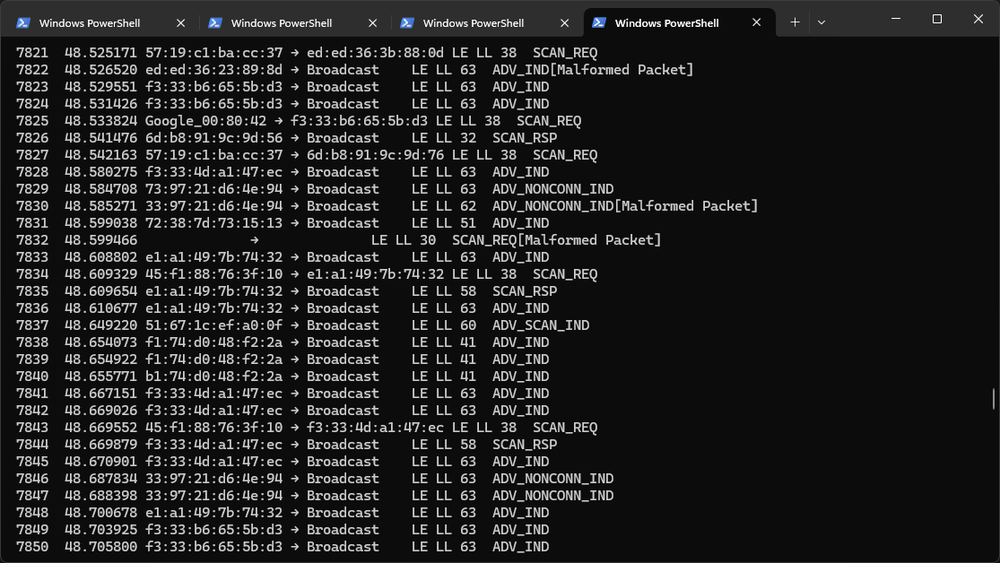

Over the past few months I have launched a foray away from my development mainstays and into Bluetooth. Specifically, reverse engineering a BLE protocol for an IoT device in order to interop it with Home Assistant.

To this end, I have spent a lot of time in the Wireshark GUI in order to capture live BLE packets with my [nRF52840](https://www.nordicsemi.com/Products/nRF52840) BLE sniffer. As a small part of that overall work, I have a wish to create some simple portable scripts in order to automate the process of extracting a unique key over the air for the device in question.

Unfortunately, the straight-forward approach using `tshark` with the same capture interface as the Wireshark GUI doesn't work out of the box with the Wireshark extcap plugin that is installed by the new `nrfutil ble-sniffer bootstrap` CLI command. No surprise, given `tshark` is [not officially supported](https://devzone.nordicsemi.com/f/nordic-q-a/96632/nrf52840-support-for-tshark/409833). But I won't let that stop me.

This article documents my deep dive into the challenges around grabbing live BLE packet stream from an nRF Sniffer in such a way you can script over the stream in a shell environment. 

My day-to-day development environment and typical target platform is anything Unix-like, but I give Windows (native Windows, i.e. Powershell) equivalent attention in this article due to my use case. Windows has some particular idiosyncrasies that mean solving this problem for some of the simpler use cases is slightly more involved than it is in Unix. Regardless, for both platforms and for different typical use cases, I will provide jumping off points F

At a high level, we cover:

* Disambiguating the new `nrfutil ble-sniffer` (that we focus on) from older packages.
* The difficulties in using `tshark` directly with the capture interface (packet capture stops by itself).
* The difficulties trying to use `nrfutil ble-sniffer sniff` directly to pipe the raw capture byte stream in real time.
* A technical exploration and analysis into how and why realtime capture works via the extcap plugin inside the *GUI* flavour of Wireshark.
* Using that analysis to arrive at a better working solution that enables (with the **new** sniffer software):
  * Live tail of the raw packet data bitstream in Unix and Windows (Powershell) shells.
  * Using that with `tshark` or whatever you like.

This post is targetted at folks who need to do the same, and so you likely have some familiarity with the tools, protocols and hardware involved. It may form a multi part series on other aspects of BLE-related tinkering in my pursuit.

## Clarification on nRF software packages

To avoid confusion and to gain important context, I am unfortunately going to have to inundate you with the intricacies of the current nRF software landscape up front.

There are effectively _two_ official parallel software packages to interface with an nRF device capable of BLE sniffing from host machine. This is because [Nordic are/have recently rebuilt their tooling ecosystem](https://devzone.nordicsemi.com/nordic/nordic-blog/b/blog/posts/nrf-util-unified-command-line-utility).

Confusingly, each option appears with the same name at various points in the documentation, yet the versioning scheme for them is completely different and they are built on different technologies. The docs of each package are somewhat muddled and conflated with each other at times, which I'm sure is just a teething issue related to recent changes. At the very least, you have to be careful to check what is being referenced when searching around these tools.

Here's my attempt at breaking down the key differences.

### Old Tooling

The **open source** Python-based [_nRF Sniffer for Bluetooth LE_](https://www.nordicsemi.com/Products/Development-tools/nRF-Sniffer-for-Bluetooth-LE), distributed as:

- A Python "core" module called `SnifferAPI` that contains all the low level hardware interface code. Documented [here](https://devzone.nordicsemi.com/cfs-file/__key/support-attachments/beef5d1b77644c448dabff31668f3a47-72c3e4570fc34e4c8a736438d5f8aa2c/3240.Nordic-Semiconductor-Sniffer-API-Guide.pdf).
- A Python [`extcap`](https://www.wireshark.org/docs/man-pages/extcap.html) plugin for Wireshark which amounts to a thin wrapper around `SnifferAPI`. Documented [here](https://docs.nordicsemi.com/bundle/nrfutil_ble_sniffer_pdf/resource/nRF_Sniffer_BLE_UG_v4.0.0.pdf).
- Also comes bundled with the nRF device sniffer firmware binaries which are to be used with flashing software like the [nRF Connect Programmer App](https://github.com/NordicSemiconductor/pc-nrfconnect-programmer).

It's typical end-user interaction patterns are therefore via:

- The Wireshark GUI and associated command line tooling, including `tshark`. There is a manual installation process of the extcap plugin by way of copying into Wiresharks plugin directories.
- Python programmatic interface for the sniffer functionality.

Other tasks you might expect an end user of my scripts to need to do, like preparing the firmware of their device, are accomplished with other packages.

### New Tooling (focus of this article)

The **closed source** [_nRF Sniffer for Bluetooth LE_](<[nrfutil-ble-sniffer](https://docs.nordicsemi.com/bundle/nrfutil/page/nrfutil-ble-sniffer/nrfutil-ble-sniffer_0.12.0.html)>) which is distributed as part of the wider unified ecosystem of [nRF Util v7+](https://docs.nordicsemi.com/bundle/nrfutil/page/README.html).

Note that this is not to be confused with the previous versions of nRF Util like these [long-since deprecated repositories](https://github.com/NordicSemiconductor/pc-nrfutil), which are before the rewrite.

This new ecosystem provides a kind of package manager and unified CLI interface over those packages, and such has a much wider scope. Individual packages cover areas such as device flashing, low level serial interfaces, and whatever else that is, or will become, part of the nRF ecosystem.

In order to try to scope this to a more direct comparison, I will focus for a moment specifically on the the nRF Util `ble-sniffer` [package](https://docs.nordicsemi.com/bundle/nrfutil/page/nrfutil-ble-sniffer/guides/installing_nrf_sniffer.html) which surfaces as `nrfutil ble-sniffer <command>` on the CLI tool. This ultimately consists of:

- A Rust-based binary executable `nrf-ble-sniffer` that serves as the "core" and contains the low level hardware interface code.
- A Rust-based binary executable `nrf-ble-sniffer-shim` that serves as the [`extcap`](https://www.wireshark.org/docs/man-pages/extcap.html) plugin for Wireshark. This is a thin process-to-process interface that sits between `nrf-ble-sniffer` and Wireshark.

It's typical end-user interaction patterns are therefore via:

- The Wireshark GUI. The extcap plugin installation process is now a case of simply executing `nrfutil ble-sniffer bootstrap`.
- The CLI of the `nrfutil ble-sniffer sniff` command. This currently allows output to a PCAP file, and has some limited debug JSON output we address later.

The notable omission of Wireshark CLI tooling like `tshark` is because it [no longer "just works"](https://devzone.nordicsemi.com/f/nordic-q-a/35750/tshark-will-not-capture-btle-packets-with-nrf-sniffer) and that tackling that problem is a primary focus of this post. 

Other tasks you might expect an end user of my scripts to need to do, like preparing the firmware of their device, are now accomplished with other installable subcommands within `nrfutil`, e.g. [the device package](https://docs.nordicsemi.com/bundle/nrfutil/page/nrfutil-device/guides/programming.html).

## Requirements for my use case

Before we deep dive into the challenges and solutions, let's clear up what I need.

The goals likely align with those of many others. I need to be able to build automations/scripts that:

1. Can ingest BLE packet data from nRF Sniffer devices.
2. Can feasibly deserialize that BLE packet data into common formats for further processing.
3. Are able to "tail" incoming BLE packets indefinitely in **real-time**.
4. Are able to filter on protocol specific packets.
5. Are based on mechanisms feasible to achieve on both Windows and Unix.
6. Work in a simple shell environment. Such that:
   1. They do not have a dependency on a GUI.
   2. Are easily composable.
7. Are simple to use:
   1. For those unfamiliar with this area.
   2. For those who may be interfacing with an nRF exclusively through the script in question to achieve it's specific goal.

## Deciding the target nRF software

Let's get one thing out of the way. You can already achieve the live-tail BLE packet capture aspect with `tshark` and the old Python extcap plugin out of the box and it's what you'd expect: things like `tshark -i <interface> -l` just work, at least on the version I used. I note that there are historic complaints about this *not* working with this version either, but I wasn't able to reproduce that.

So, that's it then? Not for me, but it might be for you. You should consider if the old ecosystem is good enough for your use case. There are many cases, like a one-time ad-hoc scripting use case where it almost certainly is fine.

I wanted to target the new `nrfutil ble-sniffer` tooling for my use case because there are some considerations that are relevant:

- The wider ecosystem that enables flashing the device and installing the extcap plugin are actually things I'd like to orchestrate as part of the wider story of my scripts, so that is compelling. Especially since I want to do that cross platform, which could be otherwise particularly tiresome to have to implement in userland in the case of device firmware flashing.
- Since I wan't something portable and long-lived, it seems perhaps unwise to base it on the older platform. But I expect many would contest me on that.
- Admittedly, yes, I also just like the idea of solving it out of pure curiosity, with the potential to help the many others who've previously asked about this.

As mentioned in my breakdown, the new ecosystem is closed source. However, whether it is open source or not simply doesn't currently factor in my requirements list on a fundamental level, and so this isn't really a salient factor in my case.

It _is_ a salient factor that it is _new_ though, if basing this choice on my own time and effort. That leads to challenges around feature gaps and documentation. However, this post hopefully removes or reduces this factor out of your own decision by way of providing solutions to those challenges.

## Getting the stream packets

To do anything meaningful, any surrounding script or tool that wants to process data in **real time** needs the basics:

1. It will orchestrate commanding the device to start capturing traffic and ultimately route the raw byte stream such that is accessible to you in real-time.
2. Have a means to be able to access the data contained therein in an idiomatic way in your language of choice. That means at some point the raw byte stream is decoded into some localised representative structure that is essentially a stream of clearly delimited and consistently structured packets, such that you can directly address all elements of the packet structure as defined in the BLE spec.

The first point is clearly something we will hand off to the nRF tooling which itself will hand off to some lower level device drivers at some point.

You would of course have to have a particular wish to reinvent the wheel from scratch to go and implement the second point yourself. A typical route would be to lean on Wireshark. It is therefore predictable and expected that when it comes to the actual meaningful user interaction with the packets, the nRF tooling provides shims that make it Wireshark's task. In the context of scripting, that would be `tshark`, which is part of Wireshark, but more on that shortly.

Of course there are other less generic and more scoped options in the Bluetooth space. Libs like [BlueZ](https://github.com/bluez/bluez) are particularly ubiquitous in BLE software stacks, and I will need another post to outline how I am also using it as a part of a specialised MITM BLE proxy that serves as alternative approach to my goal in this one (over the air key extraction of an IoT device). 

I am stating the obvious, to outline the resultant frustration that at the moment, there's no apparent first-class *documented* way (as in, "here is the Unix shell route to pipe a to b") to achieve this with `nrfutil ble-sniffer sniff` whilst staying within my requirements, without compromising on something. Well, that is, until I figured it out anyway and made this post. But it would be better if it were much more obvious in the first place. 

### Problem 1: `tshark -i` capture doesn't stay open with extcap plugin

Wireshark with the extcap plugin does what I want in that it is a live view of incoming packets. It works great in the Wireshark GUI, but I need this experience in a shell environment outside of the GUI in order to process the packets as they arrive in way I can programmatically process them. Completed PCAP dump files are not an answer since that wouldn't be real time.

`tshark` is the CLI interface of Wireshark, so the most direct approach is to use that configured to connect to the same interface as the one configured by the plugin, which is already visible & working in the Wireshark GUI. This would be convenient since when starting a capture from Wireshark, the extcap plugin binary `nrfutil-ble-sniffer-shim` automatically starts the `nrfutil-ble-sniffer` core binary

Unfortunately just firing off `tshark` with the latest version of the extcap plugin (at the time of writing) installed by `nrfutil ble-sniffer bootstrap` does not work out of the box:

```
Capturing on 'nRF Sniffer for Bluetooth LE COM6'
    1   0.000000 xx:xx:xx:xx:xx:xx → Broadcast    LE LL 63  ADV_NONCONN_IND
    2   0.000563 xx:xx:xx:xx:xx:xx → Broadcast    LE LL 63  ADV_NONCONN_IND
    3   0.009282 xx:xx:xx:xx:xx:xx → Broadcast    LE LL 63  ADV_IND
    4   0.010509 xx:xx:xx:xx:xx:xx → Broadcast    LE LL 60  ADV_SCAN_IND
4 packets captured
```

The capture abruptly ends with no error state very briefly after it starts capturing. No amount of deep exploration of `tshark` flags was able to resolve this issue. Under debug, `tshark` just reports that packet capture is being stopped.

At least we can see it is capable of parsing and displaying the few packets that are captured in the short windows it stays alive.

### Problem 2: `nrfutil ble-sniffer sniff` doesn't make piping capture data easy
 
We know `nrfutil ble-sniffer sniff` stays open and doesn't end early. So can we just pipe its output to `tshark -r -` to ingest the data over stdin? Well, actually you *can* achieve this, but only after some deeper exploration I'll save for the next section.

It isn't as clear and obvious as you might hope, and the challenges vary in size according to the platform you are targetting and the compromises you are willing to make. At the core of the problem is that the only way to access the data itself is via a file reference passed to the command as ` --output-pcap-file <path>`.


#### Trying to use the `stdout`
I tried to configure the `ble-sniffer sniff` flags to output to `stdout`. There are some promising flags available that look like they might give us what we want. For example:
```
 nrfutil --log-output=stdout --log-level=debug  --json ble-sniffer sniff --port <com-port>
```

This outputs some JSON formatted debug entries which consist of:

* Objects containing meta information about the tools version.
* Objects signalling that a new device has been found.
* Objects about operations internal to the tool.
* And finally, and somewhat promisingly, some indication of a packets contents.
 
 Sadly the actual capture bytestream is not among this data. That continues being written into a file. However, it may seem interesting though that there is some data about the packet contents in the log output regardless, but that packet data is not oven-ready to consume:

 ```
 {"type":"log","data":{"level":"DEBUG","message":"Parsed packet: Packet { header: Header { id: PacketId(2), packet_counter: 14860, protocol_version: VersionX(3), payload_length: PayloadLength(Right(53)) }, payload: EventAdvertising(EventAdvertisingPacket { header: Header { flags: AdvertisingFlags { crc: 0, aux: 0, resolved: 0, phy: 0 }, inner: InnerHeader { metadata_length: 10, channel_index: 37, rssi_sample: -70, event_counter: 0, fw_timestamp: 2159642126 } }, payload: BleRadioPacket { metadata: UncodedPhy(UncodedPhyMetadata { access_address: [214, 190, 137, 142], header: Adv(AdvPhyChPduHeader { adv_type: ADV_TYPE_ADV_SCAN_IND, tx_addr_type: Random, rx_addr_type: None, length: 34 }), padding: 0 }), data: Unknown([131, 77, 33, 200, 35, 118, 3, 3, 159, 254, 23, 22, 159, 254, 0, 0, 0, 0, 0, 0, 0, 0, 0, 0, 0, 12, 0, 0, 0, 0, 0, 0, 240, 192, 145, 82, 63]), crc: [0, 0, 0] } }) }","timestamp":"2024-12-09T21:00:16.854Z"}}
 ```

 It is clear that this is some serialised debug output of a structure within the tool, but that serialisation doesn't result in valid JSON. It could probably be parsed, but hooking into what is evidently debug structures in this way wouldn't be robust. Besides, I really want to get `tshark` working, and that requires the PCAP stream. Parsing this non-standard format doesn't really get you anywhere meaningul with regards to that aim.

 Out of curiosity, I did use an AI model to have a go at taking in an example structure in attempt to identify what libs it originates from, and it accurately inferred that this was probably a reflection of some BLE bindings for Rust shoved through `std::fmt::Debug`. This is semi-important as it implies there is some packet processing happening within `nrfutil` itself, which makes sense given that the debug log output recognises new devices. That means it is doing more than just a straight dump of the bitstream into a PCAP. This could purely be for the logging or something more, which we will come back to.


#### Just read from the file?

One solution is to simply script this in such a way as to have the `ble-sniffer sniff` command outputting to a file and running concurrently with a job to tail that file and feed the data into `tshark -l -r -`.

This works but, fundamentally, writing a file to disk which is forever growing means that this would have storage constraints that whilst small, are annoying to manage if you want this to be able to run indefinitely. You could probably actively trim that file in your own script, but its not trivial to do that in a way that doesn't corrupt it since it is a binary format. It also means `tshark` is not the thing writing the capture if you *do* want to write something to disk, and that's irritating because it means you can't meaningfully use the built in log rotation functionality via its `-a` flag.

Those who are well-versed in Unix will be screaming at me that I don't have to write the file to disk at all. That is part of the upcoming solution. However, Windows is not so clear cut and I care about that target in my case.

## Arriving at the solution

We need to somehow get  `ble-sniffer sniff` to write its output to an ethereal stream appropriate for the target OS. That stream should be [FIFO](https://en.wikipedia.org/wiki/FIFO_(computing_and_electronics)), such that the listener processes the dat as it comes. It should all happen in memory ideally.

What I just described is just a "pipe", which all OSs have. But how they are able to manifest in each OS matters for this particular problem.

Since the tool needs to be passed some "file" specifier to `--output-pcap-file <file>`, we specifically need a [Named Pipe](https://en.wikipedia.org/wiki/Named_pipe) such that the pipe is addressable by some identifier. Essentially, we wan't to ask `ble-sniffer sniff` to write to this pipe, where we can then capture it and pass it to `tshark -l -r -`.


### Windows

On Windows, [Named Pipes](https://learn.microsoft.com/en-us/windows/win32/ipc/named-pipes) don't manifest as "file" that acts as a pointer to that pipe. Instead they have they are [addressable by a different naming scheme](https://learn.microsoft.com/en-us/windows/win32/ipc/pipe-names), e.g. `\\.\pipe\BleCapture`.

There are APIs/libs to create a Windows named pipe in any general purpose language. Here we will use Powershell, in keeping with my aim to get this working in simple native shell environment.

There doesn't appear to be any low-level binaries built into Windows to interact with named pipes from the old-fashioned `cmd.exe`, but I did have success with [windows-named-pipe-utils](https://github.com/psmay/windows-named-pipe-utils). However I want what I'm doing in this post to be in clear view and not hidden behind compiled binaries, hence I'm opting for PowerShell.


#### Discovering the limitations of `--output-pcap-file`
Lets create a debug script to create and read from a named pipe:

```
# Create the pipe
$pipe = [System.IO.Pipes.NamedPipeServerStream]::new(
    "BleCapture",                       
    [System.IO.Pipes.PipeDirection]::In
)
Write-Host "Waiting for the writer (tool) to connect..."

# Wait for connection
$pipe.WaitForConnection()
Write-Host "Pipe connected."

try {
    $reader = New-Object System.IO.BinaryReader($pipe)
    while ($true) {
        $buffer = $reader.ReadBytes(1024) 
        if ($buffer.Length -ne 0) {
            # Do whatever with the buffer. Here we meaninglessly
            # print a base64 of it to the console.
            $base64Data = [Convert]::ToBase64String($buffer)
            Write-Host $base64Data
        }
    }
} finally {
    $pipe.Close()
    $reader.Close()
}
```

This snippet is simplified, but here we are creating a pipe in the `In` direction (since we are ingesting data from it) and then pulling data from it. For the sake of example we just dump the output into the console, but theoretically you can send that data on to anywhere, including `tshark`. It should be addressable as `\\.\pipe\BleCapture`.

As I feared, unfortunately just passing this reference to `--output-pcap-file` doesn't yield success:

```
nrfutil ble-sniffer sniff --port <com-port> --output-pcap-file "\\.\pipe\BleCapture"

Error: Failed to create capturer

Caused by:
    0: Could not create capture file \\.\pipe\BleCapture
    1: The parameter is incorrect. (os error 87)
```

However, my basic debug script *does* register a connection to the pipe very briefly by logging `Waiting for client...Connected`. But the `nrfutil` process errors out before actually writing anything to it. Unfortunately, pipes are not real files, and some software using certain Windows API's (particularly around file creation) won't "just work" with pipes since their assumptions about files are baked in. And sadly, there is no true way to make pipe act exactly like a file, including trying to create symlinks from a file to a pipe.

#### Finding an alternative path

Things would certainly be easier if named pipes worked natively with `--output-pcap-file`, and we can cross our fingers and hope that will arrive. But not wanting to be deterred, and equipped with the knowledge that the Wireshark GUI is doing this somehow, I started to analyse how that case is functioning. 

We can fire up Wireshark and kick off a capture in the GUI, which will internally use the `extcap` plugin that I previously installed with `nrfutil ble-sniffer bootstrap`. By using the venerable Sysinternals [Process Explorer](https://learn.microsoft.com/en-us/sysinternals/downloads/process-explorer) I can then observe how the various executables are chained, with the goal being to figure out the [IPC](https://en.wikipedia.org/wiki/Inter-process_communication) mechanism that makes it tick.

Here's the condensed process tree, including the arguments being passed to each (in my specific instance, so there are references to the COM port the sniffer is connected to on my machine):

```
Wireshark.exe
└── nrfutil-ble-sniffer-shim.exe --capture --extcap-interface COM6-4.4 --fifo \\.\pipe\wireshark_extcap_COM6-4.4_20241214180029 --extcap-control-out \\.\pipe\wireshark_control_ext_to_ws_COM6-4.4_20241214180029 --extcap-control-in \\.\pipe\wireshark_control_ws_to_ext_COM6-4.4_20241214180029 --scan-follow-rsp --scan-follow-aux
    └── nrfutil.exe ble-sniffer --capture --extcap-interface COM6-4.4 --fifo \\.\pipe\wireshark_extcap_COM6-4.4_20241214180029 --extcap-control-out \\.\pipe\wireshark_control_ext_to_ws_COM6-4.4_20241214180029 --extcap-control-in \\.\pipe\wireshark_control_ws_to_ext_COM6-4.4_20241214180029 --scan-follow-rsp --scan-follow-aux
        └── nrfutil-ble-sniffer.exe --capture --extcap-interface COM6-4.4 --fifo \\.\pipe\wireshark_extcap_COM6-4.4_20241214180029 --extcap-control-out \\.\pipe\wireshark_control_ext_to_ws_COM6-4.4_20241214180029 --extcap-control-in \\.\pipe\wireshark_control_ws_to_ext_COM6-4.4_20241214180029 --scan-follow-rsp --scan-follow-aux
```

There's a few things to take in here:

* As expected, the extcap plugin binary `nrfutil-ble-sniffer-shim` spawns `nrfutil` as a child process which is performing the actual capturing. `nrfutil` does that via another child process `nrfutil-ble-sniffer` which is a binary that is installed when the `ble-sniffer` command is installed by the user.
* There is an undocumented CLI API on `nrfutil ble-sniffer` that appears to be based around `--capture`.
* That undocumented CLI API also uses flags to indicate named pipes, which is promising!
  * `--fifo` is most likely the pipe used for the capture bytestream.
  * The `--extcap-control-in` and `--extcap-control-out` appear to be control channels for the Wireshark GUI and the extcap plugin & associated process chain to communicate in order to provide UI controls to configure the capture without restarting it. The only (loose) documentation I could find for that is [here](https://www.wireshark.org/docs/wsdg_html_chunked/ChCaptureExtcap.html).
* Other flags like `--scan-follow-rsp` and `--scan-follow-aux` are documented via `nrfutil ble-sniffer sniff --help`. These appear to be the same and just passed through.

So now we know there is indeed a CLI interface that evidently works with Windows named pipes, I was able to focus on getting this mechanism working with the pipes being created and handled by my script instead of the Wireshark GUI. After some methodical exploration by way of using this new information to call these binaries manually, I was also able to determine:

* Calling `nrfutil.exe ble-sniffer --capture --extcap-interface <com-port> <other-flags...> ` directly and in any configuration claims `--capture` is not an available flag. I suspect this is only available when launched as a child process to the extcap shim.
* Calling `nrfutil-ble-sniffer.exe --capture --extcap-interface <com-port> <other-flags...> ` directly and in any configuration, immediately exits. Again, I suspect it can only be launched as a child process to `nrfutil`.
* Calling `nrfutil-ble-sniffer-shim.exe --capture --extcap-interface <com-port>` (inside the Wireshark extcap plugin directory):
  * With only the `--fifo` pipe defined, it sends data very briefly before stopping. **This the likely underlying cause of `tshark -i <interface>` doing the same as I [described earlier](#problem-1-tshark--i-capture-doesnt-stay-open-with-extcap-plugin).** `nrfutil` expects the Wireshark GUI-specific control pipes to be available. 
  * With `--fifo` *and* the `--extcap-control-in` control channel pipe **it works**, even if you only create the `PipeDirection::Out` pipe and don't make any attempt to push control data down this channel in the way Wireshark GUI does.
  * The `--extcap-control-out` does not seem to be required. This is the channel the shim otherwise uses to talk back to the Wireshark GUI.

* Calling `nrfutil-ble-sniffer-shim.exe --extcap-interfaces --extcap-version 1.0`:
  * Allows you to list relevant nRF sniffers, including their COM port string.
  * From this I was able to determine that the part of the COM port identifier after the hyphen as passed to `--extcap-interface`, e.g. `4.4` in `COM6-4.4`, is actually determined by `--extcap-version` which seems to align with the `<major>.<minor>` of my current Wireshark version.
  * We are unlikely to care about this version string in the first instance, if we don't intend to implement the handling of the control channels, so we are likely safe using any sane value.


#### Basic POC solution

Armed with this information, I can finally converge on a solution. This snippet contains the fundamentals and acts as my proof of concept of the approach. There is more to be done, which we will get onto.

```powershell
$jobs = @()

$cancellationTokenSource = New-Object System.Threading.CancellationTokenSource
$cancellationToken = $cancellationTokenSource.Token

$fifoPipoName = "BleCaptureFifo"
$fifoPipe = New-Object System.IO.Pipes.NamedPipeServerStream(
    $fifoPipoName,
    [System.IO.Pipes.PipeDirection]::In,
    99,
    [System.IO.Pipes.PipeTransmissionMode]::Message,
    [System.IO.Pipes.PipeOptions]::None,
    65536,
    65536
)

$controlInPipeName = "BleCaptureControlIn"
$controlInPipe = [System.IO.Pipes.NamedPipeServerStream]::new(
    $controlInPipeName,                       
    [System.IO.Pipes.PipeDirection]::Out,
    99
)


# Create the named pipe server in a job
$jobs += Start-ThreadJob -ErrorAction Stop -Name $fifoPipoName -ScriptBlock {
    $pipe = $using:fifoPipe
    $token = $using:cancellationToken

    # Use WaitForConnectionAsync with the cancellation token
    $asyncTask = $pipe.WaitForConnectionAsync($token)
    $asyncTask.Wait()
    
    try {
        $reader = New-Object System.IO.BinaryReader($pipe)
        $bufferSize = 4096
        $buffer = New-Object Byte[] $bufferSize
        
        while ($true) {
            $memStream = New-Object System.IO.MemoryStream
            
            do {
                $bytesRead = $pipe.Read($buffer, 0, $buffer.Length)
                if ($bytesRead -le 0) {
                    break
                }
                $memStream.Write($buffer, 0, $bytesRead)
            } while (-not $pipe.IsMessageComplete)
            
            if ($memStream.Length -eq 0) {
                continue
            }
        
            $data = $memStream.ToArray()
            Write-Output $data
        }
    }
    finally {
        $reader.Close()
        $pipe.Close()
    }
} 


try {
    while ($true) {
        $jobs | Where-Object { ($_.HasMoreData) -or ($_.Error) } | Receive-Job -ErrorAction Stop
    }
    
}
finally {
    $cancellationTokenSource.Cancel()
    $fifoPipe.Close()
    $controlInPipe.Close()
    Stop-Job  $jobs
    Remove-Job $jobs 
}
```

To run this very raw and simple example you must first run the script in at least PowerShell 7 (Windows currently ships with PowerShell 5.x) and pipe it into `tshark`. E.g.

```
.\blereader.ps1 | & 'C:\Program Files\Wireshark\tshark.exe' -l -r -
```

Secondly, execute the extcap plugin binary to connect to the pipes used by this script, e.g:  
```
. "$env:APPDATA\Wireshark\extcap\nrfutil-ble-sniffer-shim.exe" --capture --extcap-interface COM6-4.4 --fifo \\.\pipe\BleCaptureFifo --extcap-control-in \\.\pipe\BleCaptureControlIn --scan-follow-rsp --scan-follow-aux
```

And finally, we have live-tail parsing of the BLE packets via `tshark` in Windows:



#### Taking this further

I am working on a PowerShell module which I will publish on GitHub soon (and update this post) to make this more prod-ready:

- Auto detection of `nrfutil` and `tshark` paths for easy execution.
- Automatically parallelise and configure the `nrfutil ble-sniffer sniff` job with the `tshark` job.
- Detect if the required `device` and `ble-sniffer` subcommands have been installed into `nrfutil` and automatically adds them if not.
- Automatically finds the port of the sniffer device so it doesn't have to be manually provided.
- Warn if other sniffing processes are running, which can prevent data from being received.
- Automatically terminate the sniffer process if the script dies.
- Add options to outputs PS objects for packets as represented by tshark which means your can pipe the script to PS tools like [`Out-GridView`](https://learn.microsoft.com/en-us/powershell/module/microsoft.powershell.utility/out-gridview), [`Format-List`](https://learn.microsoft.com/en-us/powershell/module/microsoft.powershell.utility/format-list), [`Format-Table`](https://learn.microsoft.com/en-us/powershell/module/microsoft.powershell.utility/format-table), etc. for PS-native formatting.

### Unix

Coming soon. It should be straightforward with `mkfifo`. Watch this space...
